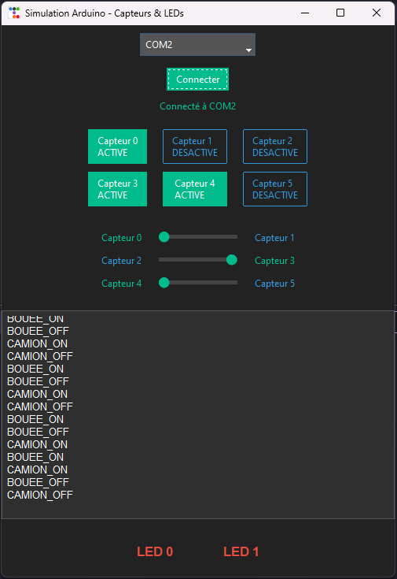

# ArduinoEmulator

Pour des besoins de débug, nous avons crée un petit programme Python simulant l'installation Arduino finale avec le déplacement de Jetons, capteurs, LEDs et envoie les bons messages sur le port série. Ainsi il n'est pas necessaire d'avoir un accès direct à la Arduino pour pouvoir programmer notre Programme Processing. 

## Prérequis

- Pour pouvoir l'utiliser il faut faire un **pont entre deux ports série**. On peut utiliser différent logiciel mais sur Windows [Virtual Serial Port Tools](https://freevirtualserialports.com/) fonctionne bien.
- **Python** installé sur la machine
- Installer les **dépendances Python** : `pip install -r requirements.txt`
## Utilisation

Une fois le pont réalisé il suffit de lancer le programme, se connecter à un des deux ports série et de connecter Processing à l'autre port série.

On peut ensuite déplacer les sliders pour simuler le déplacement des Jetons sur la maquette.
Les LEDs changent de couleur à la reception du message série adéquat.

