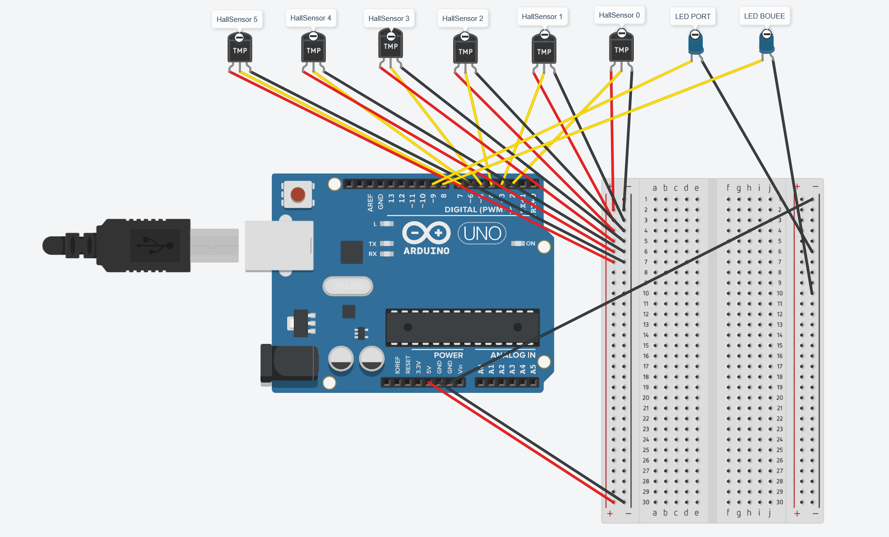
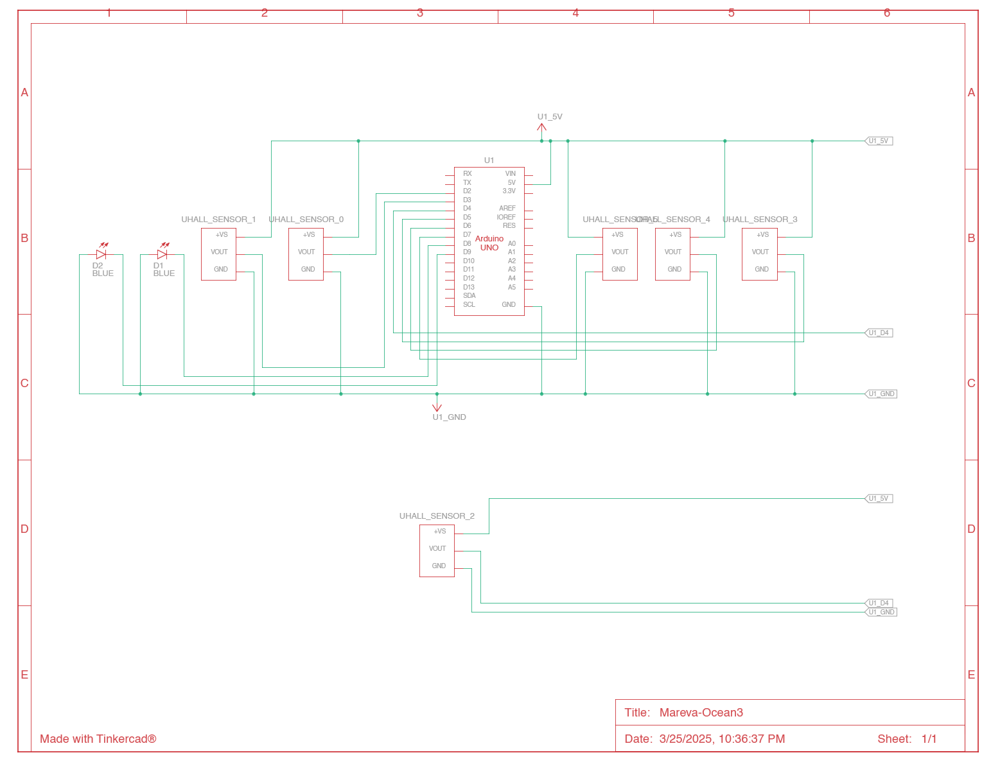
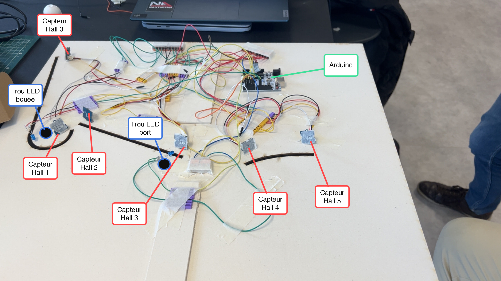

# Mareva

Ceci est le dépot lié au support de médiation du projet Mareva (Ocean3). 

# Guide technique d'installation

## Matériel necessaire
Pour réaliser la maquette intéractive, il faudra bien entendu
- La **maquette principale** en bois 
- Les **pions** et la **maquette** imprimés en 3D
- Un **écran** 1920*1080 pour l'affichage graphique.
- **Un PC disponible** avec un cable HDMI/VGA (suivant l'écran).

De plus la maquette est composée de tout un système électronique pour lequel il faudra:
- Un **Arduino Uno**
- Un cable USB-A vers USB
- 6 **capteurs digitaux à effet Hall**
- 2 **LEDs** bleues
- 4 **WAGO** à 5 entrées
- 3 **aimants**
- **Beaucoup de fils électriques** *si possible 3 couleurs pour mieux les distinguer(Noir-GND, Rouge-V, Jaune-Out)*
- Pas mal de scotch pour fixer le tout

## Mise en place du matériel

Après avoir obtenus le matériel, il faut pouvoir le mettre en place.

### Electronique

#### Branchements
Pour simplifier les branchements, on recommande de numéroter les capteurs de 0 à 5 pour simplifier le tout et coller avec nos schémas. 
En terme de branchement électronique, il suffit de suivre les schémas suivants:

<center><i>Fig 1 : Schéma visuel des branchements à effectuer sur la Arduino et entre les éléments</i></center>


<center><i>Fig 2 : Schéma technique des branchements à effectuer sur la Arduino et entre les éléments</i></center>

#### Disposition sur le plateau
Une fois les branchement électroniques effectués, on peut passer au montage sur le plateau de la maquette, il suffit simplement de disposer les capteurs et LEDs au bon endroit comme indiqué.

Il faut également penser à faire passer le cable série de la Arduino pour pouvoir la brancher au PC.

> *La partie électronique de la maquette se dispose à l'envers et necessite donc d'être scotchée grandement pour tenir.*


<center><i>Fig 3 : Image de la disposition de l'électronique sur le plateau le jour de la présentation</i></center>

### Pions

La maquette possède 3 pions qui ont le même principe avec une partie en surface qui sera visible avec en dessous une partie sur laquelle on attache un aimant.

> *Il faut faire attention à mettre l'aimant de sorte à ce qu'il soit détecté par les capteurs.*

### Le reste de la maquette 

Pour tout le reste de la maquette à mettre en place, il suffit de suivre l'image suivante en :
- Retournant le plateau et en le surélevant avec les morceaux de bois prévu à cet effet.
- Collant les éléments en bois (îles) et impressions 3D (bouées + usine + port) si ce n'est déjà fait.
- Coller les affiches.
- Suspendre la bouée en 3D.
- Si contrairement à durant la présentation il y a des trous pour faire passer les LEDs, il faut bien les faire passer au travers de la bouée. 
- Accrocher l'écran à la verticale.
- Brancher le PC à l'écran à au port série de la Arduino.


<center><i>Fig 4 : Forme finale de la maquette</i></center>

## Mise en place du site internet

Pour le site de Mareva, on a opté pour un déploiement simplifié avec Docker et un fichier docker-compose.yml pour simplifier encore le tout.

### Prérequis

Il faut pour déployer le site : 
- Un "serveur" sous **Linux** avec :
    - Docker Engine 
    - docker-compose
- Pouvoir exposer un port via une **ip** ou alors via un **domaine/sous-domaine**

### Installation

Pour l'installer il suffit de suivre les étapes suivantes : 
1. Clonez le **dépot Github** du projet.
2. Dans le dossier `MarevApp` modifiez le fichier `.env` pour y changer `NGINX_PORT` par le port sur lequel vous voulez exposer le site web. *(optionel : on peut changer le port de la db si on veut s'y connecter)*
3. Toujours dans le dossier `MarevApp` executez simplement la commande :
```bash
sudo docker-compose up -d --build
```


## Mise en place du PC

### Logiciels

Pour mettre en place le PC il faut installer dans un premier temps les logiciels suivants :
- **Arduino IDE** : Pour envoyer le programme qui va tourner sur la Arduino
- **Processing** : Pour l'affichage sur l'écran, la synchronisation avec la Arduino et avec le site.

### Etapes de mise en place

1. Clonez le **dépot Github** du projet.
2. Lancez **Arduino IDE** et envoyer le programme situé dans `./Arduino/Arduino_code.ino` vers la Arduino.
3. **Lancez Processing** et **installez** les plugins *Sound (The Processing Foundation)*, *HTTP Requests for Processing* et *Zxing For Processing (barcode library)* 
4. **Ouvrez le projet** en ouvrant le fichier `./Processing/Mareva/Mareva.pde`.
5. Dans le fichier `Mareva.pde` modifiez les variables `BASE_URL` et `SERIAL_PORT` avec respectivement l'**URL de base pour accéder au site** et le **port série pour communiquer avec la Arduino** (celui utilisé sur Arduino IDE).

# Détails techniques

Pour plus de détails en terme de code et d'architecture, on peut retrouver différentes explications dans les `README.md` de chaque partie du projet.  

